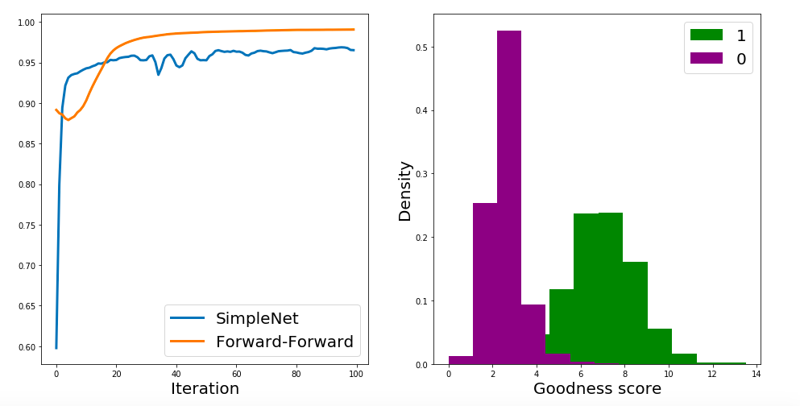

## DRD2 activity prediction using the Forward-Forward Algorithm      
>Notice: This is research code that will not necessarily be maintained in the future.
>The code is under development so make sure you are using the most recent version.
>I welcome bug reports and PRs but make no guarantees about fixes or responses.

DESCRIPTION
===========
This research project tests if [The Forward-Forward Algorithm](https://www.cs.toronto.edu/~hinton/FFA13.pdf) can be used for the Virtual High-Throughput Screening (VHTS), with the Dopamine receptor D2 (DRD2) protein target in particular.            

To train the model, the positive-negative pairs are created by sampling from the training set measurements by randomly matching active and inactive compounds. During FFA training, the network enhances the activity of the neurons for the positive examples and attenuates the signal for the negative data-points. At inference time, the `goodness score` is used as a proxy for the activity score -- the absolute value of this score is not relevant for the performance on ranking problems, such as VHTS.   

RESULTS   
=======

The Simple Feed-Forward Dense networks quickly converge to the previously reported performance at the ROC-AUC value around 95-96%.           
Surprisingly, the `ForwardForwardNet` outperforms that baseline rather easily reaching the performance at the level of ROC-AUC around 98%.

For the full code and more results, check [here](https://github.com/pgniewko/forward_forward_vhts/blob/main/ForwardForwardNet.ipynb).

REQUIREMENTS
============
These libraries are required to run the notebook code:
    
* `numpy`
* `pandas`
* `matplotlib`
* `torch`
* `rdkit`
* `scikit-learn`

## Todo

- [ ] `Layer` parameters are not FFN registerested params, so `model.eval()`, and `model.train()` won't have any effect.       

ACKNOWLEDGMENTS
===============
The `ForwardForwardNet` was adapted from the [pytorch_forward_forward](https://github.com/mohammadpz/pytorch_forward_forward) repo.        

COPYRIGHT NOTICE
================
Copyright (C) 2022-, Pawel Gniewek            
Email: gniewko.pablo@gmail.com         
All rights reserved.         
License: BSD-3    
